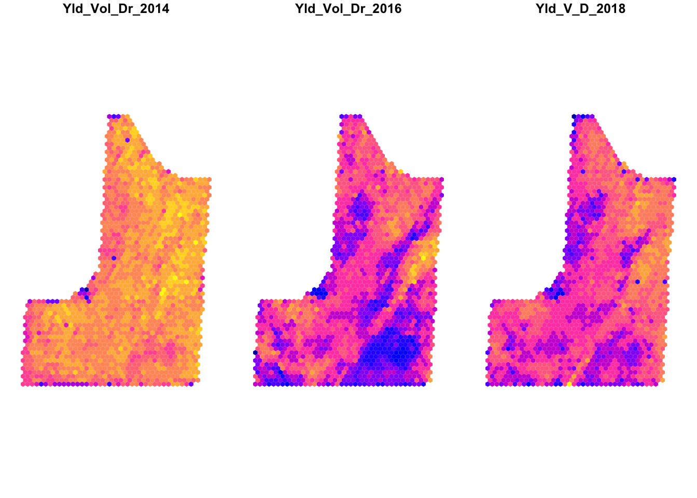
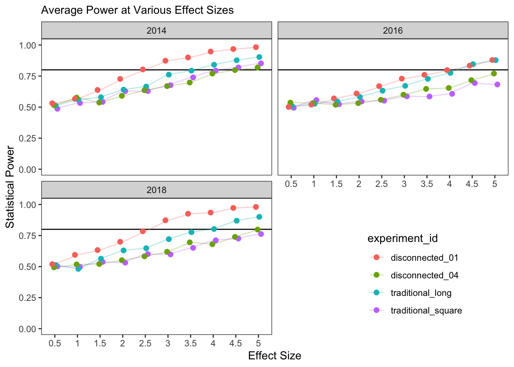

<!-- README.md is generated from README.Rmd. Please edit that file -->

```{r, include = FALSE}
knitr::opts_chunk$set(
  collapse = TRUE,
  comment = "#>",
  fig.path = "man/figures/README-",
  out.width = "75%"
)
```

# plotdesignr

<!-- badges: start -->
<!-- badges: end -->

plotdesignr provides a novel way to design agronomic field experiments with a focus on maximizing statistical power. Field research is time consuming, resource intensive, and can only be done once per year in many growing regions. Because of these constraints, it is important that every experiment is designed in a way that gives it the greatest chance of producing meaningful results.

## Installation

<!-- You can install the released version of plotdesignr from [CRAN](https://CRAN.R-project.org) with: -->

<!-- ``` r -->
<!-- install.packages("plotdesignr") -->
<!-- ``` -->

You can install the development version from [GitHub](https://github.com/) with:

``` r
# install.packages("devtools")
devtools::install_github("smmueller/plotdesignr")
```
## Example workflow

#### 1. Load multiple years of yield data and prepare for clustering
Three years of corn yield data for a field in 2014, 2016, and 2018 are loaded. The point yield observations are aggregated into a common grid of hexagonal polygons to enable comparison across years.

```{r create-cluster-df, eval=FALSE}
input_config <- read_yaml('docs/example_workflow_config.yml')
cluster_df <- make_cluster_data(config = input_config, plot = TRUE)
```

```{r show-cluster-inputs, echo=FALSE, fig.align='center'}

```


#### 2. Choose clustering parameters based on several criteria
The three years of yield data are clustered using both the yield values and the distance between yield polygons with help from the [`ClustGeo`](https://arxiv.org/pdf/1707.03897.pdf) package. The combined weighting of yield similarity and geographic continuity allows for creating clusters large enough to fit a block of the experiment inside. 

```{r explore-mixing, eval=FALSE}
explore_best_mix(processed_data = cluster_df, cluster_number = 3, range = seq(0, 0.5, 0.1), plot = TRUE, output_path = input_config$output_path)
```
```{r explore-mixing-plot, echo=FALSE, fig.align='center'}
knitr::include_graphics('docs/example_workflow_plots/mixing_parameter_map_3_clusters.png')
```

For this example, three clusters and a mixing parameter of 0.1 is selected (criteria for choosing cluster number not shown). Several criteria, as well as knowledge about the field, must be considered to create meaningful clusters.

```{r finalize-clusters, eval=FALSE}
# finalize cluster number and mixing parameter choice
clustered <- finalize_clusters(processed_data = cluster_df, cluster_number = 3, mixing_parameter = 0.1)
```

<br>

#### 3. Design new experiments 
One of the most powerful features of `plotdesignr` is the ability to interactively create and simulate various experimental designs. Once the clusters have been chosen, simply click on the map to design new experiments. The goal it to place experiment blocks inside of areas of the same cluster because those areas represent homogeneous yield environments. See the [conceptual introduction](https://rpubs.com/smmueller/plotdesignr-introduction) for more details.

<center>

{width=50%}

</center>

Experiments may either have disconnected blocks (shown here with three clusters and two different choices of "mixing parameter") or they may be "traditional" experiments with connected blocks in various arrangements. Design names (used in the final figure) from right to left: `disconnected_01`, `disconnected_04`, `traditional_square`, and `traditional_long`.

```{r mix-plots, echo=FALSE, out.width="39%", fig.show='hold'}
knitr::include_graphics(c('docs/saved_experiments/disconnected_01.png', 'docs/saved_experiments/disconnected_04.png'))
```

```{r traditional-plots, echo=FALSE, out.width="39%", fig.show='hold'}
knitr::include_graphics(c('docs/saved_experiments/traditional_square.png', 'docs/saved_experiments/traditional_long.png'))
```

#### 4. Test power of experimental designs   
The alternative designs are evaluated for statistical power at various effect sizes using the historical yield data and the [`simr`](https://besjournals.onlinelibrary.wiley.com/doi/epdf/10.1111/2041-210X.12504) package. The results below show that, on average, the design `disconnected_01` has greater statistical power for the same effect size while `disconnected_04` and `traditional_square` have the lowest power. This is made most clear in 2014 and 2018. **The interpretation is that for the same level of effect size between treatments, statistical tests are more likely to detect significant differences, when they are present, using the design `disconnected_01` compared to `traditional_square`.** 

<br>

```{r power-plots, echo=FALSE, fig.align='center'}

```

### Future work

This demonstration highlights the influence of experimental design on statistical power in field experiments and provides a framework for identifying and testing potential designs. Future work will be focused on improving recommendations for best practices in:

* How to choose cluster number
* How to choose mixing parameter
* Whether cluster data should only include the target crop
* Cleaning underlying input data
