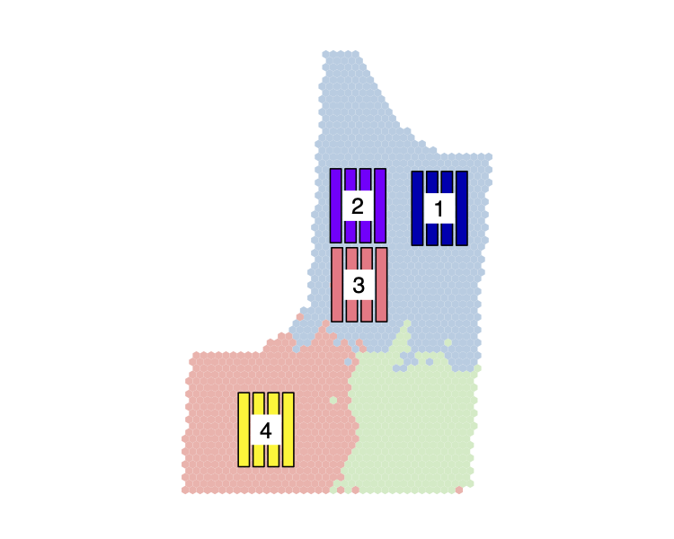

```{r setup, include=FALSE}
knitr::opts_chunk$set(echo = TRUE, cache = TRUE, collapse = TRUE, comment = "#>")
devtools::load_all()
```

```{css, echo=FALSE}
pre {
  max-height: 300px;
  overflow-y: auto;
}
```

<br>
[`plotdesignr`](https://github.com/smmueller/plotdesignr) is a package currently under development that provides a novel way to design agronomic field experiments with a focus on maximizing statistical power. Field research is time consuming, resource intensive, and can only be done once per year in many growing regions. Because of these constraints, it is important that every experiment is designed in a way that gives it the greatest chance of producing meaningful results.
<br><br>
The workflow of `plotdesignr` is demonstrated in detail with an example field that has three years of historical corn yield data. Additional documentation provides a [brief overview](https://rpubs.com/smmueller/plotdesignr-demo) and an [introduction to the statistical concepts](https://rpubs.com/smmueller/plotdesignr-introduction). 

# Understanding the input data

We will first visualize the input data to ensure our data are complete and cover the same spatial extent. The function `get_all_files` is used to load all of our intended input data. Like several functions in `plotdesignr`, `get_all_files` uses a yaml configuration file (here `inputs_config`) to provide all of the needed arguments. The full configuration for this example can be viewed on [GitHub][ghconfig]. To load the input files, the needed arguments are `path`, `files`, and `file_ids`.

```{r example-inputs}
input_config <- read_yaml('./example_workflow_config.yml')
input_config[c('path', 'files', 'file_ids')]
```

The `path` gives the common directory to all files. The files do not need to be in the same directory. The full path to the location of file `i` must be given by `paste0(path, files[i])`. If, for example, we wished to include a fourth file in a directory inside of `path`, its file name could be given as `another_folder/example field 2020.shp`. Files are read in with `sf::st_read`, so any file type supported by `sf` can be used. All `plotdesignr` spatial functions are implemented with [`sf`](https://r-spatial.github.io/sf/). Once the files have been loaded, `file_ids` is used to assign a unique identifier to each input. A current limitation is the ability to read in and transform files of various coordinate reference systems. The package currently assumes the input files are in given in WGS84 and transforms the coordinate reference system to UTM. **Proceed with caution**.   

After reading in the input files, we plot the yield data for visual inspection. The variable `var_of_interest` from our configuration gives the column name containing the yield data in each input file. We will use this to plot the yields. Notice that the `var_of_interest` name can be different in each file.

```{r plot-intro}
# read in files
intro <- get_all_files(input_config)

Var_of_interest <- input_config$var_of_interest
print(Var_of_interest)

# plot yield data
par(mfrow = c(1, 3))
for(i in seq_along(intro)){
  plot(intro[[i]][, Var_of_interest[i]], pch = 19, cex = 0.1, key.pos = NULL, reset = FALSE,
       breaks = seq(50, 250, 50), main = input_config$file_ids[i])
}
par(mfrow = c(1, 1))
```

The plots reveal some missing data in 2016, but the spatial extent look about the same for all fields. This is important because we need to choose a single field, assigned to the variable `input_config$grid_field_name` that will be used as the boundary for all other fields. These files all look about the same, so we will use arbitrarily choose 2018.  

The missing data in 2016 brings up an important point. `plotdesignr` does not perform any kind of yield cleaning and uses all input data as-is. Quality control should be performed on all input data prior to use.

# Create clustering data frame

The clustering data frame is created with `make_cluster_data`. In addition to the configuration arguments already discussed, we also need `harvest_width`, `alpha`, `passes_to_clip`, and `cellsize_scaler`. A snippet from the [configuration][ghconfig] is shown below.

```{more-configs-make-cluster-df}
# Combine header width in in METERS
harvest_width: 4.572
# smoothing parameter for finding field boundary.
# lager numbers (100) are simplier and follow data points less closely
# than smaller numbers (1)
alpha: 50
# number of passes to remove as end rows
passes_to_clip: 3
# number of combine header widths that should be used to create grid cells
cellsize_scaler: 2
```

After loading the input data, the field boundary for the file specified by `input_config$grid_field_name` will be automatically detected based on the finding the edge of the yield points. `alpha` is the smoothing parameter used when determining the field boundary. Choosing an appropriate value for `alpha` may take some trial and error, but 50 is a good place to start. 

Once the field boundary has been created, the end rows, or headlands, can be removed. The outside  `passes_to_clip * harvest_width` will be clipped. The resulting boundary (field with the end rows removed) generated for a single field is then used to clip all other files. This results in three fields all with the same spatial extent.  

There is still one more step. In order to cluster the different years of data, we need to match yield points across the files, but yield in not reported in the exact same location each year. The solution is to create a grid of hexagonal polygons inside the clipped field boundary. Each polygon in the grid is approximately the size of `harvest_wide * cellsize_scaler`. It is recommended that `cellsize_scaler` be greater than one in order to avoid empty cells. Each grid polygon is then assigned the median yield of all the points inside of it. Because the coordinates of the polygon are the same for each input field, these can be compared across years during clustering. 

```{r create-cluster-df, message=FALSE, results='hide'}
cluster_df <- make_cluster_data(config = input_config, plot = TRUE)
```
```{r head-clusterdf}
head(cluster_df)
```

The function `make_cluster_data` returns a single `sf` object, which is a data frame with a `geometry` list-column. As shown above, our new data frame, `cluster_df` contains the median yield value for each polygon in the grid. This is the data we will use to cluster.   

A feature demonstrated in `make_cluster_data` is `plot = TRUE`. In the config file, we have already give the argument `input_config$output_path`. A PDF of the plot of cluster data will be saved to this path. If the specified directory does not exist, it will be created. If we do not want to save the PDFs, the argument `input_config$output_path` can be set to `NULL`. There are two primary benefits to saving the plots 1) for future reference and 2) many of the plots are large files and load slowly in RStudio. Saving the plots makes it much easier to quickly view different plots or view multiple plots at once. If you wish to also view the plots in the RStudio graphics device use the argument `plot = TRUE`.  

A note about the missing data in 2016 - notice that there are no missing polygons in the cluster data figure. This is because the polygon is assigned the median of the intersecting yield observations. Therefore, as long as at least one point intersects with the polygon, it will not be `NA`.

# Choose clustering parameters

## Cluster number

There are two parameters that must be chosen to cluster the data: cluster number and mixing parameter. The motivation for clustering is described in the [conceptual introduction](https://rpubs.com/smmueller/plotdesignr-introduction). Briefly, maximum power in a randomized complete block design is achieved by minimizing within block variation. Hierarchical clustering with geographical constraints is used to determine "homogeneous" zones of the field that are also large enough to place the blocks. More testing is needed to provide robust recommendations for this process, however some helper functions have been developed to assist in choosing the best parameterization. 

To start, let's view the non-geographically constrained clusters both as a map and as a dendrogram. We will begin by only considering two clusters.

```{r explore-dendro-2, out.width="49%", fig.align='center'}
# view dendrogram to see where clusters might naturally break
# plot will be saved to the directory given by output_path
explore_dendrogram(processed_data = cluster_df, cluster_number = 2, plot = TRUE, output_path = input_config$output_path)
```

The dendrogram suggests the data "naturally" breaks into two, or maybe three, clusters. Let's also view the three cluster results.

```{r explore-dendro-3, out.width="49%", fig.align='center'}
explore_dendrogram(processed_data = cluster_df, cluster_number = 3, plot = TRUE, output_path = input_config$output_path)
```

Using three clusters, the group that was red in the first plot gets split into blue and red in the second plot. Notice that the red areas in the three cluster plot seem to overlap with the missing data in the 2016. This highlights the importance of historical knowledge about the field in order to fully interpret the clusters. We will try to avoid the red areas because of the known missing data.

In addition to observing the dendrograms, we can also consider formal tests to suggest cluster number. Keep in mind, these are just suggestions based on various criteria. The current tests are total within sum of squares (often called the elbow method), silhouette width, and the Calinski Harabasz Index. 

```{r explore-tests, fig.align='center'}
explore_cluster_number(processed_data = cluster_df, kmax = 6, plot = TRUE, output_path = input_config$output_path)
```

From the returned plot, all of these tests agree that the ideal cluster number is two with three also being a candidate, but a large decrease in the silhouette width and CH Index at four. Again, this is where knowledge about the field and the intended experimental design is important. Based on the dendrogram and maps from `explore_dendrogram`, we choose a cluster number of three so we can be sure to avoid the red area in the three-cluster plots.

## Mixing parameter (geographical constraint)

So far we have only considered non-geographically constrained clusters. However, as shown in the maps returned from `explore_dendrogram`, it may be hard to fit plots into these clusters because they are quite disperse. Adding geographic constraint with the package [`ClustGeo`](https://arxiv.org/pdf/1707.03897.pdf) can create more geographically compact clusters by considering the distance between yield polygons in addition to the similarity in yield. The mixing parameter controls how much weight is given to the geographical constraint versus yield similarity. The line graph and maps returned from `explore_best_mix` demonstrate the impact of the mixing parameter.

```{r explore-mixing, fig.align='center'}
explore_best_mix(processed_data = cluster_df, cluster_number = 3, range = seq(0, 0.5, 0.1), plot = TRUE, output_path = input_config$output_path)
```

First considering the line graph, the black line shows that the "cluster quality" (Q), with respect to the yield data (D0), decreases rapidly with a mixing parameter (alpha) greater than 0.1. The red line (D1) indicates the cluster quality with respect to the geographical constraint and therefore increases as more weight is given to the distance matrix. We desire the largest mixing parameter that does not negatively impact yield cluster quality. This criteria is met by 0.1. See the [`ClustGeo`](https://arxiv.org/pdf/1707.03897.pdf) documentation for more information about how to interpret this line graph.

The maps visualize the impact of the mixing parameter. As the mixing parameter increases from 0 (no geographical constraint) to 0.5 the clusters become more geographically compact. Choosing the best mixing parameter may take trial and error (see simulation section below), and will be a focus of future work. In the current example, the map for the mixing parameter of 0.1 has the same problem as the non-geographically constrained scenario - the clusters are very scattered. On the other hand, the map for mixing parameter 0.4 shows large clusters in which it would be easy to place blocks of the experiment, but the line graph suggests that these clusters are providing very little value in terms of yield similarity. We choose 0.1 and use `finalize_clusters` to add the column `cluster` to `cluster_df`.

```{r finalize-clusters}
# finalize cluster number and mixing parameter choice
clustered <- finalize_clusters(processed_data = cluster_df, cluster_number = 3, mixing_parameter = 0.1)

head(clustered)
```

# Design new experiments

One of the most powerful features of `plotdesignr` is the ability to create and simulate various experimental designs. This starts with the `make_experiment` function, which takes a few more arguments from the configuration file: plot length, plot width, width of border between plots, the number of treatments, and the number of blocks. The treatment number controls how many plots will be in each block. The current implementation is focused on randomized complete block design because it is commonly used in on-farm research. A snippet of the relevant section of the configuration file  is shown.

```{plot-specs-config}
# length of simulated plots in METERS
# 300 ft/3.281
plot_length: 91.436
# width of simulated plots in METERS
# 45 ft/3.281
plot_width: 13.715
# width of border betweeen simulated plots in METERS
# 15 ft/3.281
border_width: 4.572
# number of treatments in simulated experiment
treatment_number: 4
# number of blocks in simulated experiment
block_number: 4
```

```{r load-experiments, echo=FALSE}
disconnected_01 <- readRDS('./saved_experiments/disconnected_01.rds')
disconnected_04 <- readRDS('./saved_experiments/disconnected_04.rds')
traditional_square <- readRDS('./saved_experiments/traditional_square.rds')
traditional_long <- readRDS('./saved_experiments/traditional_long.rds')
```

We will start by creating two "disconnected" experiments. With these experiments, we will try to place each block in a homogeneous zone. The `make_experiment` function takes as arguments the experiment type (a connected experiment will be explained in a moment), the `sf` object with a `cluster` column returned from `finalize_clusters`, the configuration file, an optional rotation angle, and the name to give the saved plot. We saw in our first plots of the input data that the rows in this field run north and south, which is the default direction of the plots. If the rows ran east and west we could use the argument `rotation = 90` to rotate the experiment to be the same direction as the rows. 

When we run

```{r disconnected-01, eval=FALSE}
disconnected_01 <- make_experiment(experiment_type = 'disconnected',
                                   clustered_sf = clustered, config = input_config,
                                   rotation_angle = NULL, plot_name = 'disconnected_01')
```

a map with the colored clusters will appear in the graphics window and a prompt asking us to choose four points by clicking on the map will appear in the console. Each point we click will be the center of a block. After four points have been chosen (one for each block as specified by `input_config$block_number`), the new blocks will be plotted on the map with labels indicating the block number. If you do not like the position of the blocks, simply run the command again to overwrite your previous selection. `make_experiment` returns an `sf` object with the polygons for each plot in the new experiment. Each polygon has a plot and block label. At this point there is still no concept of treatment assignment. The image of the new experiment will automatically be saved to `input_confit$output_path` if one has been given with the name specified by `plot_name`. 

As already discussed, our current choice of three clusters and a mixing parameter of 0.1 make it somewhat hard to find homogeneous areas to place our blocks. Avoiding the southeast corner because of the missing data in 2016, we choose the following layout.

```{r disconnected-01-plot, echo=FALSE, fig.align='center'}
knitr::include_graphics('./saved_experiments/disconnected_01.png')
```

For demonstration purposes, let's also explore using a mixing parameter of 0.4, which would make it much easier to place blocks inside of distinct clusters. 

```{r disconnected-04, eval=FALSE}
# update sf object with new cluster assignments
clustered_04 <- finalize_clusters(processed_data = cluster_df, cluster_number = 3, mixing_parameter = 0.4)

# create another experiment
disconnected_04 <- make_experiment(experiment_type = 'disconnected',
                                   clustered_sf = clustered_04, config = input_config,
                                   rotation_angle = NULL, plot_name = 'disconnected_04')
```

```{r disconnected-04-plot, echo=FALSE, fig.align='center'}

```

We will also create some "traditional" experiments to test. Traditional refers to experiments where all the blocks connected. To show the flexibility in traditional experiment design, we will create two, one with the blocks arranged in a 2 x 2 square, and another with all blocks arranged end-to-end. The arguments `block_rows` and `block_columns` control how the blocks are arranged in relation to each other. This time, we will be prompted to select only a single point, the center of the entire experiment, instead of one for each block. 

```{r traditional-experiments, eval=FALSE}
traditional_square <- make_experiment(experiment_type = 'connected',
                                      clustered_sf = clustered, config = input_config,
                                      rotation_angle = NULL, plot_name = 'traditional_square',
                                      block_rows = 2, block_cols = 2)

traditional_long <- make_experiment(experiment_type = 'connected',
                                    clustered_sf = clustered, config = input_config,
                                    rotation_angle = NULL, plot_name = 'traditional_long',
                                    block_rows = 4, block_cols = 1)

```


```{r traditional-plots, echo=FALSE, out.width="49%", fig.show='hold'}
knitr::include_graphics(c('./saved_experiments/traditional_square.png', './saved_experiments/traditional_long.png'))
```

# Test power of experimental designs

The alternative designs are evaluated for statistical power at various effect sizes using the historical yield data and the [`simr`](https://besjournals.onlinelibrary.wiley.com/doi/epdf/10.1111/2041-210X.12504) package. `plotdesignr` provides a few helper functions to assist in preparing the simulations. In the code blocks below we read in the input yield data using the same configuration file. `get_test_data` returns a list of input data where each list element is a different year of yield data for this field. Once the data is loaded, `get_experiment_data` clips the yield data for each experiment. This is the data that will be used in the simulations.

```{r get-sim-data, message=FALSE, results='hide'}
# Read in simulation data
# A warning message indicates that var_of_interest has been renamed so they are all the same
sim_data_list <- get_test_data(config = input_config)
```

```{r get-exp-data}
# create a list of experimental designs to test
experiment_list <- list(traditional_square = traditional_square, 
                        traditional_long = traditional_long, 
                        disconnected_01 = disconnected_01,
                        disconnected_04 = disconnected_04)

# Clip yield data with experiment polygons
masked_field <- get_experiment_data(experiment_list = experiment_list,
                                    simulation_data = sim_data_list)
head(masked_field)
```

After clipping the data, we get the average yield of each plot to be used in the testing for treatment effects. The last step to prepare for the simulation is to randomly assign treatments to the plots ensuring that each treatment is present once per block as specified by the randomized complete block design. 

```{r summarize-anova-data}
# get plot means for ANOVA
sim_df_means <- masked_field %>%
  st_drop_geometry() %>% # remove the geometry column
  group_by(block, plot, unique_id, experiment_id, file_id) %>% 
  summarize(yield = mean(Yld_Vol_Dr)) # get the average "plot" yield for each experiment and yield data file

# add treatment labels
set.seed(1113)
sim_df_means <- sim_df_means %>% group_by(block, unique_id) %>% mutate(treatment = sample(1:4, n()))

head(sim_df_means)
```

Now we are ready to run our simulations.
<br>

The function `simr::powerSim` performs the power simulations. This function takes a fitted model object as an argument, so we must first fit models for each of our 12 scenarios (4 experimental designs and 3 years of test data). Each experiment is a randomized complete block design with yield as the response variable, treatment as the fixed effect, and block as the random effect. Therefore we will specify the model as: 
```
lmer(yield ~ treatment + (1|block))
```
Because we have many models to specify, we will do this in a list. 
```{r specify-models, message=FALSE}
library(simr)
library(parallel)
library(ggplot2)

lmer_list <- lapply(unique(sim_df_means$unique_id), function(id){
  temp_data <- sim_df_means %>% filter(unique_id == id)
  exp_lmer <- lmer(yield ~ treatment + (1| block), data = temp_data)
})
names(lmer_list) <- unique(sim_df_means$unique_id)

# example of the summary for one model
summary(lmer_list[[1]])
```

The printed summary of the first model shows that the treatment effect is not significant. This is what we expect since we did not apply any treatments. 

More information about `simr` can be found [here](https://besjournals.onlinelibrary.wiley.com/doi/epdf/10.1111/2041-210X.12504). For our use case, we will specify a range of effect sizes to test (0.5 to 5 in 0.5 increments). To reduce computation time, we will also set the number of simulations to 100 instead of the default value of 500. At a high level, `simr::powerSim` works by simulating new values of yield for each given effect size, and then re-fitting and testing the statistical model. This method assumes that there really is a treatment effect, so every positive result is considered a true positive, and every negative result a false negative (Type II error). Again, we will do this within a list because we have multiple models to simulate.

Please note, using seven cores on my machine (using `parallel::parLapply`), this takes several minutes to run.
```{r load-power-results, echo=FALSE}
power_df <- readRDS('./saved_experiments/power_df.rds')
```

```{r simulate-power, eval=FALSE}
# set effect size and simulation number
effect_size <- seq(0.5, 5, 0.5)
nsim <- 100

# make clusters for parallel::parLapply and set seed for reproducible results
cl <- makeCluster(detectCores() - 1, type = 'FORK')
clusterSetRNGStream(cl, iseed = 1113)

# simulate power for each element in the list lmer_list
sim_list <- lapply(lmer_list, function(lmer_res){
  
  # simulate power for each effect size in effect_size
  power_res <- parLapply(cl, effect_size, function(ef){
    # replace the model treatment effect with effect_size
    fixef(lmer_res)['treatment'] <- ef
    # refit the model with simulated data at the new effect size nsim times and store the pvalue
    ef_pval <- powerSim(lmer_res, nsim = nsim, progress = FALSE)$pval
    # convert pvalue to power
    ef_power <- 1 - ef_pval

    return(ef_power)
  })
  names(power_res) <- ef
  power_df <- data.frame(power_res)

  return(power_df)
})
stopCluster(cl)

# bind all results into single data frame
power_df <- data.table::rbindlist(sim_list, idcol = 'source')

head(power_df, 2)
tail(power_df, 2)
```
```{r head-sims, echo=FALSE}
head(power_df, 2)
tail(power_df, 2)
```

The last object created in the above code block is `power_df`. In this data frame, `source` identifies each experiment design and the file from which the yield data came and each column `X*` is the treatment effect specified in `effect_size`. There is 1 row for each simulation, resulting in 100 rows for each unique `source`.

Finally, we can rearrange the data frame into the long format, calculate the 95% confidence interval for power at each effect size, and plot our results. For readability, confidence intervals are only plotted for the highest and lowest power designs. A black horizontal line indicates power = 0.80, the conventional threshold.

```{r data-wrangle-and-plot}
# melt data from wide to long format
power_df_long <- data.table::melt(power_df, id.vars = 'source', variable.name = 'effect_size', value.name = 'power')
# remove 'X' from effect size names
power_df_long[, effect_size := gsub('X', '', effect_size)]

# caclulate average and 95% CI for each source and effect size
plot_df <- power_df_long[, .('power' = mean(power),
                             'upper' = quantile(power, 0.975),
                             'lower' = quantile(power, 0.025)), by = .(source, effect_size)]
# split source into its parts of experiment and file_id
plot_df[, c('experiment_id', 'file_id') := data.table::tstrsplit(source, "_(?!.*_)", perl = TRUE)]
```

```{r power-plots, echo=FALSE, fig.align='center'}

ggplot(plot_df, aes(x = effect_size, y = power, col = experiment_id, group = experiment_id)) +
  geom_hline(aes(yintercept = 0.8)) +
  geom_point(position = position_dodge(width = 0.3), size = 2) +
  geom_line(alpha = 0.3) +
  ylim(0, 1) +
  facet_wrap(~ file_id, nrow = 2) +
  labs(subtitle = 'Average Power at Various Effect Sizes') +
  theme_bw() +
  theme(legend.position = c(0.8, 0.2),
        panel.grid = element_blank())

ggplot(data = plot_df[experiment_id %in% c('disconnected_01', 'traditional_square')], 
       aes(x = effect_size, y = power, col = experiment_id, group = experiment_id)) +
  geom_hline(aes(yintercept = 0.8)) +
  geom_point(position = position_dodge(width = 0.5), size = 2) +
  geom_line(alpha = 0.3) +
  geom_errorbar(aes(ymin = lower, ymax = upper), width = 0.1,
                position = position_dodge(width = 0.5), alpha = 0.5) +
  ylim(0, 1) +
  labs(subtitle = 'Average Power and 95% Confidence Intervals for Two Experimental Designs') +
  facet_wrap(~ file_id, nrow = 2) +
  theme_bw() +
  theme(legend.position = c(0.8, 0.2),
        panel.grid = element_blank())
```

The results show that, on average, the design `disconnected_01` has greater statistical power for the same effect size compared to all other designs. These results support the concept that simply placing an experiment in the center of a field with no regard for environmental homogeneity within the blocks reduces statistical power. At the same time, `disconnected_04` has similar power to `traditional_square`. This highlights that geographically compact clusters with low cluster quality with respect to yield (black line from `explore_best_mix`) provide little value.

In addition to choosing a layout for the future experiment, the power simulations can also be used to determine the needed effect size, which could inform treatment decisions. In this example, continuous treatments of values one to four were used. The effect size in the power simulation plots represents the slope of the treatment effects (example `fixef(lmer_list[[1]])['treatment'] = -0.1988`). Using this information and the confidence intervals shown, the interpretation is that the slope of the treatment response needs to be 4.5 bushels or larger using the design `disconnected_01` (years 2014 and 2018) in order to achieve 95% confidence that the statistical power is between 0.8 and 1. However, as shown by the 2016 results, each year is different and results will vary.

# Future work

This demonstration highlights the influence of experimental design on statistical power in field experiments and provides a framework for identifying and testing potential designs. Future work will be focused on improving recommendations for best practices in:

* How to choose cluster number
* How to choose mixing parameter
* Whether cluster data should only include the target crop
* Cleaning underlying input data

<br><br>
`plotdesignr` is still in development and is available on [GitHub](https://github.com/smmueller/plotdesignr).

<!-- common links -->
[ghconfig]: https://github.com/smmueller/plotdesignr/blob/master/docs/example_workflow_config.yml
