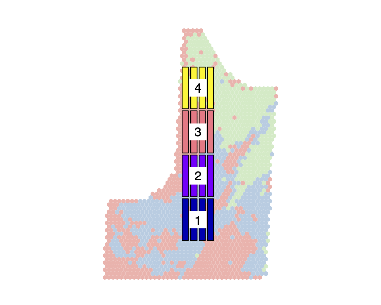

```{r setup, include=FALSE}
knitr::opts_chunk$set(echo = TRUE, cache = TRUE, collapse = TRUE, comment = "#>")
devtools::load_all()
```

The workflow of `plotdesignr` is demonstrated with an example field that has three years of historical corn yield data.

## Understanding the input data

First, we will visualize the input data. Let's make sure our data is complete and view the spatial extent of the data. We will use the function `get_all_files` to load all of our intended input data. Like several functions in `plotdesignr`, `get_all_files` uses a configuration file (here `inputs_config`) to provide all the needed arguments. In this case, the needed inputs are:
```{r example-inputs}
input_config <- read_yaml('./example_workflow_config.yml')
input_config[c('path', 'files', 'file_ids')]
```
The `path` gives the common directory to all files. The files do not need to be in the same directory. To read in each file, `paste0(path, files[i])` is used, so `files` gives the remainder of the path, which may include directories or just the file name. Files are read in with `sf::st_read`, so any file type supported by `sf` can be used. Lastly, `file_ids` is used to assign a unique identifier to each input. After reading in the input data, we plot the yield data in order to visually inspect it. For this, we will use the variable `var_of_interest` that we have assigned in our input configuration. This is a vector of strings that gives the column name in each file that contains the yield data.

```{r plot-intro}
# read in files
intro <- get_all_files(input_config)
Var_of_interest <- input_config$var_of_interest

# plot yield data
par(mfrow = c(2, 2))
for(i in seq_along(intro)){
  plot(intro[[i]][, Var_of_interest[i]], pch = 19, cex = 0.1, key.pos = NULL, reset = FALSE,
       breaks = seq(50, 250, 50), main = input_config$file_ids[i])
}
par(mfrow = c(1, 1))
```

We can see that there is some missing data in 2016, but the spatial extents look about the same for all fields. This is important because we need to choose a single field, assigned to the variable `input_config$grid_field_name` that will be used as the boundary for all other fields. Since these all look about the same, we will use 2018. 

## Create a data frame for clustering

Next we will create the clustering data frame with `make_cluster_data`. In addition to the config arguments already disussed, we also need:
```{more-configs-make-cluster-df}
# Combine header width in in METERS
harvest_width: 4.572
# smoothing parameter for finding field boundary.
# lager numbers (100) are simplier and follow data points less closely
# than smaller numbers (1)
alpha: 50
# number of passes to remove as end rows
passes_to_clip: 3
# number of combine header widths that should be used to create grid cells
cellsize_scaler: 2
```
This indicates that after finding the field boundary based on the yield measurement data points, we want to remove the outside `passes_to_clip * harvest_width` as headlands/endrows. The choice of `alpha` may take some guess and check, but 50 is a good starting point. The last argument, `cellsize_scaler`, is used when "stacking" the multiple years of yield data. In order to cluster the multi-year data, we need to assign "matching" yield points across years. To allow for this, a grid of hexagonal polygons is created inside the clipped field boundary. Each polygon in the grid is approximated the size of `harvest_wide * cellsize_scaler`. It is recommended that this value be greater than one in order to avoid empty cells. Each grid polygon is then assigned the median yield of all the points inside of it. Because the coordinates of the polygon is the same for each input field, these can be compared across years during clustering. 

```{r create-cluster-df, message=FALSE, results='hide'}
cluster_df <- make_cluster_data(config = input_config, plot = TRUE)
```
```{r head-clusterdf}
head(cluster_df)
```

The function `make_cluster_data` returns a single `sf` object, which is like a normal data frame, except for the additional of a `geometry` column. As shown above, our new data frame, `cluster_df` contains the median yield value for each polygon in the grid. This is the data we will use to cluster.   

Another feature demonstrated in `make_cluster_data` is `plot`. In the config file, we have already give the argument `input_config$output_path`. A PDF of the clustered data plot will be saved to this path. If the specified directory does not exist, it will be created. If we do not want to save the PDF's, the argument can be set to `NULL`. There are two benefits to saving the plots 1) for future reference and 2) many of the plots are large files and slow to load in RStudio, saving them makes it much easier to "flip through" the plots. If we wish to also view the plots in the RStudio graphics device, the argument `plot = TRUE` can be used. 

## Choose clustering parameters

Next, we need to choose how to cluster our data. As a reminder, the key idea is that maximum power in a randomized complete block experiment, maximum power will be achieved by placing each block in a homogenous zone of the field. Hierarchical clustering with geographical constraints is used to determine "homogenous" zones of the field, but doing the clustering is quite subjective. Optimizing this process will be a focus of future work, however some helper functions have been developed to assist in choosing the best parameterization. 

First, let's view the non-geographically constrained clusters both as a map and as a dendrogram. For simplicity, we will start by considering only two clusters.
```{r explore-dendro-2}
# view dendrogram to see where clusters might naturally break
explore_dendrogram(processed_data = cluster_df, cluster_number = 2, plot = TRUE, output_path = input_config$output_path)
```

Starting with the dendrogram, it appears the data "naturally" breaks into two, or maybe three, clusters. Let's also view the three-cluster results.

```{r explore-dendro-3}
explore_dendrogram(processed_data = cluster_df, cluster_number = 3, plot = TRUE, output_path = input_config$output_path)
```

When we use three clusters, the group that was red in the first plot gets split into blue and red in the second plot. If you recall from the first exploratory plots, the areas red areas in the three cluster plot seem to overlap with the missing areas in the data from 2016. Prehaps this is a low-lying areas that drowned out that year? This is where it is important to have instiutional knowledge about the field in order to fully interpret the clusters. In any case, it seems like the red cluster may be an area we want to avoide placing our experiment in.

Now that we have a feel for how the data might naturally break, we can also consider some formal tests to suggest cluster number. Keep in mind, these are just suggestions based on various criteria. The current tests are total within sum of squares (often called the elbow method), silhouette width, and the Calinski Harabasz Index. 

```{r explore-tests}
explore_cluster_number(processed_data = cluster_df, kmax = 6, plot = TRUE, output_path = input_config$output_path)
```

From the returned plot, all of these tests appear to agree that the ideal cluster number, which maximizes similarity within the cluster and differences between the clusters, is two. However, that does not mean that two is the best value for our purpose. Again, this is where knowledge about the field and the intended experimental design is important. Based on the dendrogram and maps from `explore_dendrogram`, we may want to use a cluster number of three so we can be sure to avoid the red area in the three-cluster plots. The various metrics shown above indicate that using three clusters can also yield clusters that really are different from each other, however there is a large decrease in the the silhouette width and CH Index for four clusters, so we probably should not choose four.

Based on the dendrogram and formal tests, we will choose to create three clusters in this field.

So far we have only considered non-geographically constrained clusters. However, as shown in the maps returned from `explore_dendrogram`, it may be hard to fit plots into these clusters. Becasue of this, we will now add a geographic constraint using the package `ClustGeo`. Without going into too much detail, this will to the hierarchical clustering we have been working with an additional constraint of how close the yield polygons are to each other. This should help in creating clusters large enough to place an experiment inside. Now that a cluster number has been choosen, we need to chooose a mixing parameter that controls how much weight is given to the geographical constraint. To do this, let's view how the quality of the clusters (as assessed by the Q value from `ClustGeo`) and the map changes with different mixing parameters.

```{r explore-mixing}
explore_best_mix(processed_data = cluster_df, cluster_number = 3, range = seq(0, 0.5, 0.1), plot = TRUE, output_path = input_config$output_path)
```

First considering the line plot, the black line shows that the "cluster quality" with resplect to the yield data (D0) decreases rapidly with a mixing parameter (alpha) greater than 0.1. The red line (D1) indicates the cluster quality with respect to the geographical constraint and therefore increases as more weight is given to the distance matrix, but this is not our primary concern. We are more interested in D0. The line graph is suggesting we using a mixing parameter of 0.1.

The maps make the impact of the mixing parameter more clear. As the mixing parameter increases from 0 (no geographical constraint, this should be the same as the map returned with `explore_dendrogram`) to 0.5 the clusters become more geographically continuous. Choosing the best mixing parameter will likely take trial and error (see simulation section below), and will be a focus of future work. In the current scenario, the map for the mixing parameter of 0.1 has the same problems as the non-geo constrained scenario - the clusters are very scattered. On the other hand, the map for mixing parameter 0.3 is the first time the clusters really "come together", but the line graph suggests that these clusters are providing very little information. We choose 0.1 and use `finalize_clusters` to add a `cluster` to `cluster_df`.

```{r finalize-clusters}
# finalize cluster number and mixing parameter choice
clustered <- finalize_clusters(processed_data = cluster_df, cluster_number = 3, mixing_parameter = 0.1)

head(clustered)
```

## Design new experiments

One of the most powerful features of `plotdesignr` is the ability to create and simulate various experiment designs. This starts with the `make_experiment` function, which takes a few more arguments from the config file. From the config, we need the experiment specifications of plot length, width, width of border between plots, the number of treatments, and the number of blocks. The treatment number controls how many plots there should be in each block. The current implementation is focused on randomized complete block design since that is common for on-farm research. The relevent section of the config file looks like this:

```{plot-specs-config}
# length of simulated plots in METERS
# 300 ft/3.281
plot_length: 91.436
# width of simulated plots in METERS
# 45 ft/3.281
plot_width: 13.715
# width of border betweeen simulated plots in METERS
# 15 ft/3.281
border_width: 4.572
# number of treatments in simulated experiment
treatment_number: 4
# number of blocks in simulated experiment
block_number: 4
```

```{r load-experiments, echo=FALSE}
disconnected_01 <- readRDS('./saved_experiments/disconnected_01.rds')
disconnected_04 <- readRDS('./saved_experiments/disconnected_04.rds')
traditional_square <- readRDS('./saved_experiments/traditional_square.rds')
traditional_long <- readRDS('./saved_experiments/traditional_long.rds')
```

We will start by creating two "disconnected" experiments. With these experiments, we will try to place each block in a homogeneous zone. The `make_experiment` function takes as arguments the experiment type (a connected experiment will be explained in a moment), the sf object with a `cluster` column returned from `finalize_clusters`, the configuration file, an optional rotation angle, and the name to give the saved plot. We saw in our first plots of the input data that the rows in this field run north and south, which is the default direction of the plots. If instead, the rows ran east and west we could use the argument `rotation = 90` to rotate the experiment to be the same direction as the rows. 

When we run

```{r disconnected-01, eval=FALSE}
disconnected_01 <- make_experiment(experiment_type = 'disconnected',
                                   clustered_sf = clustered, config = input_config,
                                   rotation_angle = NULL, plot_name = 'disconnected_01')
```

a map with the colored clusters will appear in the graphics window and a prompty asking us to choose four points by clicking on the map will appear in the console. Each point we click will be the center of a block. After four points have been choosen (one for each block as specified in the config), the new blocks will be plotted on the map with labels indicating the block number. If you do not like the position of the blocks, simply run the command again to overwrite your previous selection. `make_experiment` returns an sf object with the polygons for each plot in the new experiment. Each polygon has a plot and block label. At this point there is still no concept of treatment assignment. The plot of the new experiment will automatically be saved to `input_confit$output_path` if one has been given with the name specified by `plot_name`. 

As already discussed, our current choice of three clusters and a mixing parameter of 0.1 make it somewhat hard to find homogenous areas to place our blocks, but keeping in mind from the intial look at the data that we may want to avoid the southeast corner because of a lot of missing data in 2016, we choose the following layout.

```{r disconnected-01-plot, echo=FALSE, fig.align='center'}

```

For demonstration purposes, let's also explore what the impact might be if we choose a mixing parameter of 0.4, which would make it much easier to place blocks inside of difference clusters. 

```{r disconnected-04, eval=FALSE}
# update sf object with new cluster assignments
clustered_04 <- finalize_clusters(processed_data = cluster_df, cluster_number = 3, mixing_parameter = 0.4)

# create another experiment
disconnected_04 <- make_experiment(experiment_type = 'disconnected',
                                   clustered_sf = clustered_04, config = input_config,
                                   rotation_angle = NULL, plot_name = 'disconnected_04')
```

```{r disconnected-04-plot, echo=FALSE, fig.align='center'}
knitr::include_graphics('./saved_experiments/disconnected_04.png')
```

Lastly, we will create some "traditional" experiments to test. Traditional refers to experiments that are continous (all the blocks connected) as is the common way to design a field experiment. To show the flexiblity in traditional experiment design, we will create two, one with the blocks arranged in a 2 x 2 square, and another with all blocks arranged end-to-end. For this type of experiment, the `experiment_type = 'connected'` and `block_rows` and `block_columns` control how the blocks are arranged in relation to each other. This time, the prompt will tell us to select only a single point (instead of one for each plot) and the point we click will be the center of the entire experiment. 

```{r traditional-experiments, eval=FALSE}
traditional_square <- make_experiment(experiment_type = 'connected',
                                      clustered_sf = clustered, config = input_config,
                                      rotation_angle = NULL, plot_name = 'traditional_square',
                                      block_rows = 2, block_cols = 2)

traditional_long <- make_experiment(experiment_type = 'connected',
                                    clustered_sf = clustered, config = input_config,
                                    rotation_angle = NULL, plot_name = 'traditional_long',
                                    block_rows = 4, block_cols = 1)

```


```{r traditional-plots, echo=FALSE, out.width="49%", fig.show='hold', fig.align='center'}
knitr::include_graphics(c('./saved_experiments/traditional_square.png', './saved_experiments/traditional_long.png'))
# 
```

## Simulate power of alternative experimental designs

The last step is to test our alternative experimental designs. We will use the R package `simr` to simulate experimental power at various effect sizes using the three years of yield data. `plotdesignr` provides a few helper functions to assist in getting the needed data. In the code blocks below we read in the input yield data using the same configuration file. `get_test_data` returns a list of input data where each list element is a different year of yield data for this field. After reading in the data, `get_experiment_data` finds the overlap between the yield data and the polygons of each experiment. This is the data that will be used in the simulations.

```{r get-sim-data, message=FALSE, results='hide'}
# Read in simulation data
sim_data_list <- get_test_data(config = input_config)
```

```{r get-exp-data}
# create a list of experimental designs to test
experiment_list <- list(traditional_square = traditional_square, 
                        traditional_long = traditional_long, 
                        disconnected_01 = disconnected_01,
                        disconnected_04 = disconnected_04)

# Find intersection with experiment polygons
masked_field <- get_experiment_data(experiment_list = experiment_list,
                                    simulation_data = sim_data_list)
head(masked_field)
```

After subsetting to the needed data, we get the average yield of each plot to be used in our RCB ANOVA. The last step to prepare for the simulation is to randomly assingn treatments to the blocks, as if it were a real experiment. Treatments are assigned to the plots randomly, since no actual treatment has been applied. As we will see shortly, these yield values will be used to test power at varying levels of effect size.

```{r summarize-anova-data}
# get plot means for ANOVA
sim_df_means <- masked_field %>%
  st_drop_geometry() %>% # remove the geometry column
  group_by(block, plot, unique_id, experiment_id, file_id) %>% 
  summarize(yield = mean(Yld_Vol_Dr)) # get the average "plot" yield for each experiment and yield data file

# add treatment labels
set.seed(1113)
sim_df_means <- sim_df_means %>% group_by(block, unique_id) %>% mutate(treatment = sample(1:4, n()))

head(sim_df_means)
```

Now we are ready to run our simulations.  
We need to load some packages that are not automatically loaded with `plotdesignr`. As stated previously, `simr` is a package that enables simulatation based power calculations. Because we want to do many simulations on 12 scenarios (4 experimental designs and 3 years of test data), we will also use `parallel` to speed up the compuations. Lastly, we will load `ggplot2` to visualize our results.

The function `simr::powerSim` takes a fitted model object as an argument, so we must first fit models for each of our 12 scenarios. We are fitting a RCBD with yield as the response variable, treatment as a fixed effect, and block as a random effect. Therefore we will specifiy our model as: 
```
lmer(yield ~ treatment + (1|block))
```
Becasue we have many models to specify, we will do this in a list. 
```{r specify-models, message=FALSE}
library(simr)
library(parallel)
library(ggplot2)

lmer_list <- lapply(unique(sim_df_means$unique_id), function(id){
  temp_data <- sim_df_means %>% filter(unique_id == id)
  exp_lmer <- lmer(yield ~ treatment + (1| block), data = temp_data)
})
names(lmer_list) <- unique(sim_df_means$unique_id)

# example of the anova for first model
summary(lmer_list[[1]])
```

The printed summary of the first model shows that the treatement effect is not significant. This is what we we expect since we did not have an real treatments. 

For more information about `simr`, please see THESE LINKS. In brief, for our use case, we will specify a range of effect sizes to test (0.5 to 5 in 0.5 intervals). To reduce computation time, we will also set the the number of simulations to 100 instead of the default value of 500. At a high level, `simr::powerSim` works by simulating new values of yield for each given effect size, and then re-fitting and testing the statistical model. This method assumes that there really is a treatment effect, so every positive result is considered a true positive, and every negative result a false negative (Type II error). Again, we will do this within a list because we have multiple models to simulate.

Please note, using seven cores on my machine, this takes several minutes to run.
```{r load-power-results, echo=FALSE}
power_df <- readRDS('./saved_experiments/power_df.rds')
```

```{r simulate-power, eval=FALSE}
# set effect size and simulation number
effect_size <- seq(0.5, 5, 0.5)
nsim <- 100

# make clusters for parrallel::parLapply and set seed for reproducible results
cl <- makeCluster(detectCores() - 1, type = 'FORK')
clusterSetRNGStream(cl, iseed = 1113)

# simulate power for each element in the list lmer_list
sim_list <- lapply(lmer_list, function(lmer_res){
  
  # simulate power for each effect size in effect_size
  power_res <- parLapply(cl, effect_size, function(ef){
    # replace the model treatment effect with effect_size
    fixef(lmer_res)['treatment'] <- ef
    # refit the model with simulated data at the new effect size nsim times and store the pvalue
    ef_pval <- powerSim(lmer_res, nsim = nsim, progress = FALSE)$pval
    # convert pvalue to power
    ef_power <- 1 - ef_pval

    return(ef_power)
  })
  names(power_res) <- ef
  power_df <- data.frame(power_res)

  return(power_df)
})
stopCluster(cl)

# bind all results into single data frame
power_df <- data.table::rbindlist(sim_list, idcol = 'source')
```

The above code block results in a single data frame where `source` identifies each experment and the file from which the yield data came and each column `X*` is the treatment effects specified in `effect_size`. There is 1 row for each simulation, resulting in 100 rows for each unique `source`.

```{r head-power-df}
head(power_df, 2)
tail(power_df, 2)
```

Finally, we will rearrange the data frame into the long format, calculate the 95% confidence interval for power at each effect size, and plot our results. To improve readability, confidence intervales are only plotted for the highest and lowest power designs. A black horizonal line indicates power = 0.80, the conventional threshold.

```{r data-wrangle-and-plot}
# melt data from wide to long format
power_df_long <- data.table::melt(power_df, id.vars = 'source', variable.name = 'effect_size', value.name = 'power')
# remove 'X' from effect size names
power_df_long[, effect_size := gsub('X', '', effect_size)]

# caclulate average and 95% CI for each source and effect size
plot_df <- power_df_long[, .('power' = mean(power),
                             'upper' = quantile(power, 0.975),
                             'lower' = quantile(power, 0.025)), by = .(source, effect_size)]
# split source into its parts of experiment and file_id
plot_df[, c('experiment_id', 'file_id') := data.table::tstrsplit(source, "_(?!.*_)", perl = TRUE)]
```

```{r power-plots, echo=FALSE}

ggplot(plot_df, aes(x = effect_size, y = power, col = experiment_id, group = experiment_id)) +
  geom_hline(aes(yintercept = 0.8)) +
  geom_point(position = position_dodge(width = 0.3), size = 2) +
  geom_line(alpha = 0.3) +
  ylim(0, 1) +
  facet_wrap(~ file_id, nrow = 2) +
  labs(subtitle = 'Average Power at Various Effect Sizes') +
  theme_bw() +
  theme(legend.position = c(0.8, 0.2),
        panel.grid = element_blank())

ggplot(data = plot_df[experiment_id %in% c('disconnected_01', 'traditional_square')], 
       aes(x = effect_size, y = power, col = experiment_id, group = experiment_id)) +
  geom_hline(aes(yintercept = 0.8)) +
  geom_point(position = position_dodge(width = 0.5), size = 2) +
  geom_line(alpha = 0.3) +
  geom_errorbar(aes(ymin = lower, ymax = upper), width = 0.1,
                position = position_dodge(width = 0.5), alpha = 0.5) +
  ylim(0, 1) +
  labs(subtitle = 'Average Power and 95% Confidence Intervals for Two Experimental Designs') +
  facet_wrap(~ file_id, nrow = 2) +
  theme_bw() +
  theme(legend.position = c(0.8, 0.2),
        panel.grid = element_blank())
```

Our results highlight the important of testing multiple years, however the clear winner in both 2014 and 2018 is `disconnected_01`. The inconsisent results and low power in 2016 is not surprising given the data quality issues we observed at the very beginning. This is an important reminder tht no work was done here to improve or ensure yield data quality - this is yet another focus of future work.

If `disconnected_01` appears to be the best performing model, `traditional_square` and `disconnected_04` perform the worst. This builds a case for the potential reduction in power for simply placing an experiment in the center of a field with no regard for environmental homogenity within the blocks. At the same time, `disconnected_04` as about the same power, highlighting that just because the clusters appear homogeneous due to a high mixing parameter, it is very important to give credence to the underlying cluster quality.

## Final remarks

This demonstration highlights the influence of experimental design on statistical power in field experiments and provides a framework for identifying and testing potential designs. In order to make this work as impactful as possible, more work is needed to make recommendations for best practices in:

* Should cluster data only include the target crop, or any historical field data
* How to choose cluster number
* How to choose mixing parameter
* Cleaning underlying input data

