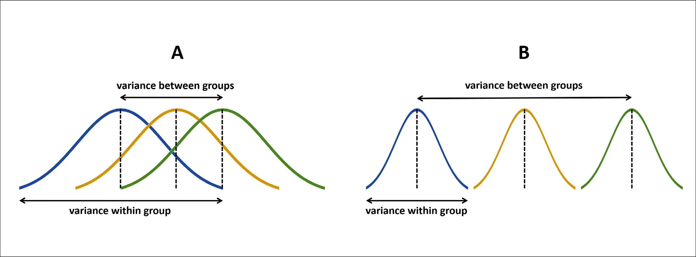

```{r setup, include=FALSE}
knitr::opts_chunk$set(echo = TRUE, cache = TRUE, collapse = TRUE, comment = "#>")
```

<br>
[`plotdesignr`](https://github.com/smmueller/plotdesignr) is a package currently under development that provides a novel way to design agronomic field experiments focused on maximizing statistical power. Field research is time consuming, resource intensive, and can only be done once per year in many growing regions. Because of these constraints, it is important that every experiment is designed in a way that gives it the greatest chance of producing meaningful results.

### Challenge
In large field experiments, spatial variability can cause "noisy" data. This underlying spatial variability, combined with small differences among treatments, creates a perfect storm for low-powered experiments that are unlikely to detect significant treatment effects, even if they are present.

### Review of Statistical Power
Power =  1 - $\beta$   
where $\beta$ represents the probability of committing a Type II error (fail to reject the null hypothesis when it is actually false). Put another way, statistical power represents the probability that a test of significance will detect a treatment effect when it is actually present.  

Power depends on three things:

1. Effect size - the magnitude of difference between treatments. All else equal, it is easier to detect differences between treatments when the effect size is larger.
2. Sample size - the number of observations in each sample. All else equal, power increases with sample size because of the inverse relationship between sample number in sampling error.
3. Alpha - the alpha value that will be used in tests of significance. This is typically 0.05.

When designing field experiments, there are often limitations in the ability to change the factors influencing power. Alpha is likely dictated by previous literature and accepted convention and sample size might be limited by space, financial resources, and time. It is possible to create large effect size by choosing starkly contrasting treatments, but this may not provide useful insights or meet research goals.

Another idea to consider is altering the physical design of an experiment. Here, the example of the randomized complete block design (RCBD) is used. The RCBD is commonly employed in agronomic research. In brief, the RCBD subdivides the field into "blocks" and each treatment is randomly assigned to plots within each block. It is a defining characteristic of the RCBD that all treatments are present in each block exactly one time.   

### Review of ANOVA and Linear Mixed Models

Experiments conducted with a RCBD will likely be tested using linear mixed models. Mixed models are used to test the fixed effect (here, treatments) separately from the random effects (here, blocks). To understand more fully how RCBD work with linear mixed models a visualize an example is helpful. 

As a quick refresher, ANOVA (analysis of variance) is used to test if group means are significantly different from each other when comparing more than two groups. This is accomplished by evaluating the ratio of *between* group variance to *within* group variance.

```{r anova-image, echo=FALSE, fig.align='center', fig.cap='Graphic representation of ANOVA. Image credit: [Liguori and Moreira](https://doi.org/10.21470/1678-9741-2018-0378)'}

```


In order for groups, or treatments, to be considered significantly different from each other, the variance *between* groups needs to be large compared to the variance *within* group. First, consider an experiment with only fixed effects, for example a completely randomized design (CRD). In this type of experiment, treatments are randomly assigned to plots with no restrictions on randomization. The ANOVA table for a CRD experiment with **N** observations and **K** treatments looks like:

<br>
```{r crd-table, echo=FALSE, fig.align='center', fig.cap='ANOVA table for completely randomized design.'}
knitr::include_graphics('./images/CRD.png')
```
<br>

If we add blocks to a CRD, treatments are no longer assigned at random over this whole experiment. Instead, treatments are randomly assigned to plots within each block, resulting in a RCBD. The updated ANOVA table with **B** blocks looks like:

<br>
```{r rcbd-table, echo=FALSE, fig.align='center', fig.cap='ANOVA table for randomized complete block design.'}
knitr::include_graphics('./images/RCBD.png')
```
<br>

Testing for significance in the block effect is usually not of interest and therefore only the calculation for the treatment F value is shown. However, as highlighted by the green box, adding the random effect of block impacts the denominator of the treatment F value (MST/MSE) by *removing error from the MSE*. Assuming there is real spatial variation and all else equal, introducing blocks to the experimental design will:

* Decrease the sum of squares error (SSE = SSTotal - SSTr - SSB)
* Decrease the mean square error (MSE = SSE / (N - K - B- 1))
* Increase the F value (MSTr / MSE)

Blocking can provide many benefits, but it should be noted that blocks are not free. Because blocks impose a restriction on randomization, they cost degrees of freedom. In order for a block to be statistically "worth it", the decrease in SSE needs to be greater than the loss of degrees of freedom. If the the decrease in degrees of freedom is equal or greater in magnitude to the decrease in SSE, MSE will not be reduced and the F value will not increase. To maximize the utility of blocks, they should be arranged in a way that minimizes within block variation and maximizes between block variation.

### Influence of block placement in experiment results

In a demonstration experiment, a RCBD with 4 treatments (A, B, C, D) is arranged into 4 blocks. The field used in for the experiment naturally has an East-West gradient where yields increase from East to West. Because of this known spatial variation, the use of blocks is appropriate. The treatments have been assigned different means (10, 5, 2, and 1, respectively), and therefore, if a statistical test fails to reject the null hypothesis it will be a Type II Error (fail to reject the null hypothesis when it is false).

<details><summary>See code to generate experiment</summary>
```{r demo-experiment, message=FALSE}
library(data.table)
library(lmerTest)
library(ggplot2)

# set block and treatment number
n_blocks <- 4
n_treats <- 4

# define the field latitude and longitude 
lat <- 1:(n_blocks*n_treats)
lon <- 1:(n_blocks*n_treats)

# create a design that ensures all treatments were present in both directions
order <- data.table('4' = c('A', 'B', 'C', 'D'), 
                    '3' = c('D', 'C', 'A', 'B'),
                    '2' = c('B', 'A', 'D', 'C'),
                    '1' = c('C', 'D', 'B', 'A'),
                    'ns_block' = 1:4)
# melt to long format
order_long <- melt(order, id.vars = 'ns_block', variable.name = 'ew_block', value.name = 'treat', variable.factor = FALSE)
order_long[, ew_block := as.numeric(ew_block)]

# create the experimental data
set.seed(77)
field_df <- data.table(expand.grid('lat' = lat, 'lon' = lon))

# sort by long and add ns_blocks
setorder(field_df, lon)
field_df[, ns_block := rep(1:n_blocks, each = n_blocks, length.out = nrow(field_df))]

# sort by lat and add ew_blocks
setorder(field_df, lat)
field_df[, ew_block := rep(1:n_blocks, each = n_blocks, length.out = nrow(field_df))]

# add plot ids
field_df[, plot := paste0(ns_block, ew_block)]

# merge field_df and treatment information
exp <- order_long[field_df, on = c('ns_block', 'ew_block')]

# create an east/west gradient to the field yields
exp[, yield_lat := lat*2]

# add a treatment effect
exp[treat == 'A', yield_t := rnorm(.N, 10, 1)]
exp[treat == 'B', yield_t := rnorm(.N, 5, 1)]
exp[treat == 'C', yield_t := rnorm(.N, 2, 1)]
exp[treat == 'D', yield_t := rnorm(.N, 1, 1)]

# make biased_yield by summing the treatment effect (yield_t) and spatial yield gradient (yield+lat)
exp[, yield := yield_lat + yield_t]

# set blocks to factors for lmer
exp[, ns_block := as.factor(ns_block)]
exp[, ew_block := as.factor(ew_block)]

# format for plotting
# function to find ymin/ymax and xmin/xmax for geom_rect
find_borders <- function(df, by_var){
  df[, paste0(by_var, '_xmin') := min(lat) - 0.5, by = by_var]
  df[, paste0(by_var, '_xmax') := max(lat) + 0.5, by = by_var]
  
  df[, paste0(by_var, '_ymin') := min(lon) - 0.5, by = by_var]
  df[, paste0(by_var, '_ymax') := max(lon) + 0.5, by = by_var]
}

find_borders(exp, 'plot')
find_borders(exp, 'ew_block')
find_borders(exp, 'ns_block')

# where the treatment labels should be placed
exp[, text_loc_x := mean(lat), by = plot]
exp[, text_loc_y := mean(lon), by = plot]

# nice labels for density plots
exp[, ew_block_labels := paste('Block', ew_block)]
exp[, ns_block_labels := paste('Block', ns_block)]
```
</details>
<br>
```{r experiment-plot, fig.align='center', fig.cap='Demonstration experiment with 4 treatments (A, B, C, D) and a natural yield gradient running East-West.', out.width='50%'}
ggplot(exp, aes(x = lat, y = lon)) +
  geom_raster(aes(fill = yield)) +
  geom_rect(aes(xmin = plot_xmin, xmax = plot_xmax,
                ymin = plot_ymin, ymax = plot_ymax), fill = NA, col = 'black') +
  scale_fill_viridis_c(alpha = 0.7) +
  geom_text(aes(x = text_loc_x, y = text_loc_y, label = treat), size = 10) +
  theme_void()
```
<br>

For the sake of example, the treatments have been arranged to ensure that each treatment is present whether the blocks are arranged East-West (each block contains the whole spectrum of the underlying yield gradient) or North-South (each block contains a similar section of the underlying yield gradient).

<br>
```{r experiment-plot-blocks, echo=FALSE, warning=FALSE, fig.show='hold', fig.align='center', fig.cap='Demonstration experiment with 4 treatments (A, B, C, D) and 4 blocks arranged either in an East-West or North-South design.', out.width='40%'}
ggplot(exp, aes(x = lat, y = lon)) +
  geom_raster(aes(fill = yield)) +
  geom_rect(aes(xmin = ew_block_xmin, xmax = ew_block_xmax,
                ymin = ew_block_ymin, ymax = ew_block_ymax), fill = NA, col = 'black', size = 2) +
  scale_fill_viridis_c(alpha = 0.7) +
  labs(title = 'East-West Design') + 
  geom_text(aes(x = text_loc_x, y = text_loc_y, label = treat), size = 10) +
  theme_void()

ggplot(exp, aes(x = lat, y = lon)) +
  geom_raster(aes(fill = yield)) +
  geom_rect(aes(xmin = ns_block_xmin, xmax = ns_block_xmax,
                ymin = ns_block_ymin, ymax = ns_block_ymax), fill = NA, col = 'black', size = 2) +
  scale_fill_viridis_c(alpha = 0.7) +
  labs(title = 'North-South Design') + 
  geom_text(aes(x = text_loc_x, y = text_loc_y, label = treat), size = 10) +
  theme_void()
```
<br>

To compare these two possible designs, density plots of the yield values by treatment (colors) and blocks (facets) show that the East-West blocks result in good separation of treatment effects, but the blocks all overlap (each block covers the whole spectrum of yield values). On the other hand, the density plots of the North-South design reveals much less separation between treatment, but the blocks are clearly separated. For instance, the average yield of block 1 is near 10, while block 4 is near 35.

<br>
```{r experiment-density, echo=FALSE, warning=FALSE, fig.show='hold', fig.align='center', fig.cap='Distribution of yields for two different experimental designs in a demonstration experiment with 4 treatments (A, B, C, D) and 4 blocks.', out.width='49%'}

ggplot(exp) +
    geom_density(aes(x = yield, fill = treat), alpha = 0.7) +
    scale_fill_viridis_d(name = 'treatment') +
    facet_wrap(~ ew_block_labels, nrow = 2) +
    labs(title = 'East-West Design') +
    theme_classic() +
    theme(strip.background = element_rect(fill="lightgray"))

ggplot(exp) +
    geom_density(aes(x = yield, fill = treat), alpha = 0.7) +
    scale_fill_viridis_d(name = 'treatment') +
    facet_wrap(~ ns_block_labels, nrow = 2) +
    labs(title = 'North-South Design') +
    theme_classic() +
    theme(strip.background = element_rect(fill="lightgray"))
```
<br>

The density plots may suggest that East-West design is the better because the treatments are the most clearly separated, but what does testing with a linear mixed model find? To run the analysis, the mean yield of each plot is obtained. Remember, the plot means are not impacted by the two experimental designs under consideration. The only difference between the designs is the assignment of plot to block. The model is specified with treatment as a categorical fixed effect and the block as a random effect.

```{r models, message=FALSE, warning=FALSE}
# calculate means
df_means <- exp[, .('mean_yield' = mean(yield)), by = .(plot, treat, ew_block, ns_block)]

# fit linear mixed models
ew_result <- lmer(mean_yield ~ treat + (1|ew_block), data = df_means)
ns_result <- lmer(mean_yield ~ treat + (1|ns_block), data = df_means)
```

```{css, echo=FALSE}
pre {
  max-height: 300px;
  overflow-y: auto;
}
```

```{r ew-result}
summary(ew_result)
```

```{r ns-result}
summary(ns_result)
```

After reviewing at the summary results of the two models, it is immediately it is clear that the East-West design finds only the intercept (treatA) to be significantly different from the other three treatments while all treatments are different in the North-South design. Looking more closely, notice that the `Estimates` are the same between the two models, as expected, because the treatment means were not impacted by experimental design. The information under `Random effects` reveals what is going on. The variance term represents the SSB from the RCBD ANOVA table presented previously. In the East-West design, the variance is zero, meaning block explained none of the error and therefore all of the error remained in the `Residual` term (SSE in the ANOVA table). In contrast, in the North-South design nearly all of the total error being explained by the block, thereby greatly reducing the MSE and resulting in significant differences. This is an extreme example, but it illustrates the point that block placement has a lot of influence on the results of a linear mixed model.

It should also be acknowledged that the degrees of freedom are different between the two models. Without going into detail, remember that in mixed models degrees of freedom are approximated and the default method used by `lmerTest` is the Satterthwaite approximation. This approximation accounts for the change in degrees of freedom between models.

This example shows that the physical design of an experiment can greatly impact the ability to detect significant differences. More attention must be given to experimental design in order to maximize the power of agronomic experiments. `plotdesignr` provides a novel and powerful way to test various designs prior to conducting field experiments. For more details on the functionality of this package, please see the [overview](https://rpubs.com/smuelle/plotdesignr-demo).
