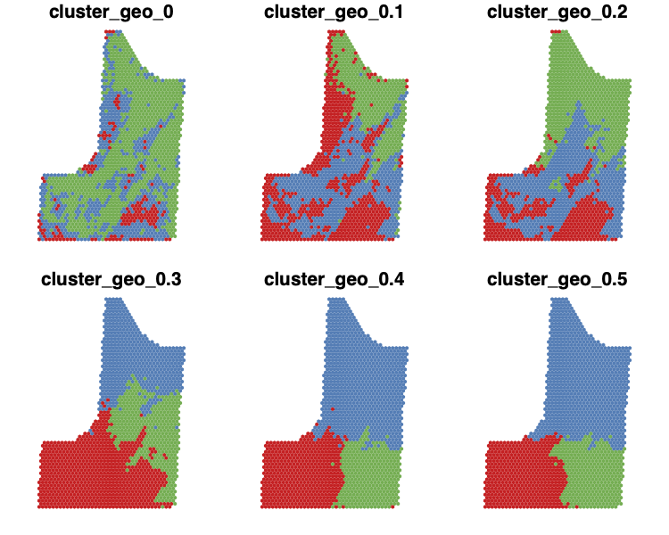
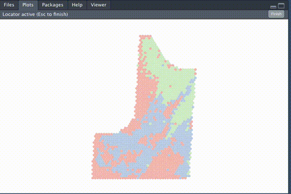

```{r setup, include=FALSE}
knitr::opts_chunk$set(echo = TRUE, cache = TRUE, collapse = TRUE, comment = "#>")
devtools::load_all()
```
   
<br>
[`plotdesignr`](https://github.com/smmueller/plotdesignr) is a package currently under development that provides a novel way to design agronomic field experiments with a focus on maximizing statistical power. Field research is time consuming, resource intensive, and can only be done once per year in many growing regions. Because of these constraints, it is important that every experiment is designed in a way that gives it the greatest chance of producing meaningful results.

### Challenge
In large field experiments, spatial variability can cause "noisy" data. This underlying spatial variability, combined with small differences among treatments, creates an opportunity for low-powered experiments that are unlikely to detect significant treatment effects, even if they are present.

### Solution
Using historical yield data, clustering is used to detect homogeneous areas of the field in which each block of an experiment can be placed. See the [conceptual introduction](https://rpubs.com/smmueller/plotdesignr-introduction) for more details.

### Current Functionality

The following is a brief example of the `plotdesignr` workflow and functionality. More detailed documentation, including example data, can be found in the [detailed example](https://rpubs.com/smmueller/plotdesignr-detailed-example).

#### 1. Load multiple years of yield data and prepare for clustering
Three years of corn yield data for a field in 2014, 2016, and 2018 are loaded. The point yield observations are aggregated into a common grid of hexagonal polygons to enable comparison across years.

```{r create-cluster-df, message=FALSE, results='hide'}
input_config <- read_yaml('./example_workflow_config.yml')
cluster_df <- make_cluster_data(config = input_config, plot = TRUE)
```

#### 2. Choose clustering parameters based on several criteria
The three years of yield data are clustered using both the yield values and the distance between yield polygons with help from the [`ClustGeo`](https://arxiv.org/pdf/1707.03897.pdf) package. The combined weighting of yield similarity and geographic continuity allows for creating clusters large enough to fit a block of the experiment inside. The following plot shows a range of mixing parameters from 0 to 0.5. As the mixing parameter increases, the relative importance of geographic similarity also increases.

```{r explore-mixing, eval=FALSE}
explore_best_mix(processed_data = cluster_df, cluster_number = 3, range = seq(0, 0.5, 0.1), plot = TRUE, output_path = input_config$output_path)
```
```{r explore-mixing-plot, echo=FALSE, fig.align='center'}

```

For this example, three clusters were chosen (criteria for choosing cluster number not shown). Several metrics, as well as knowledge about the field, must be considered to choose the appropriate mixing parameter. 
```{r finalize-clusters}
# finalize cluster number and mixing parameter choice
clustered <- finalize_clusters(processed_data = cluster_df, cluster_number = 3, mixing_parameter = 0.1)
```

<br>

#### 3. Design new experiments 
One of the most powerful features of `plotdesignr` is the ability to interactively create and simulate various experimental designs. Once the clusters have been chosen, simply click on the map to design new experiments. The goal is to place experiment blocks inside of areas of the same cluster because those areas represent homogeneous yield environments. See the [conceptual introduction](https://rpubs.com/smmueller/plotdesignr-introduction) for more details.

<center>

{width=50%}

</center>

```{r load-experiments, echo=FALSE}
disconnected_01 <- readRDS('./saved_experiments/disconnected_01.rds')
disconnected_04 <- readRDS('./saved_experiments/disconnected_04.rds')
traditional_square <- readRDS('./saved_experiments/traditional_square.rds')
traditional_long <- readRDS('./saved_experiments/traditional_long.rds')
```

Experiments may either have disconnected blocks (shown here with three clusters and two different choices of mixing parameter) or they may be "traditional" experiments with connected blocks in various arrangements.

```{r mix-plots, echo=FALSE, out.width="49%", fig.show='hold', fig.cap='Left: disconnected_01, three clusters with mixing parameter of 0.1. Right: disconnected_04, three clusters with mixing parameter of 0.4'}
knitr::include_graphics(c('./saved_experiments/disconnected_01.png', './saved_experiments/disconnected_04.png'))
```

```{r traditional-plots, echo=FALSE, out.width="49%", fig.show='hold', fig.cap='Left: traditional_square, traditional experiment with blocks in a 2x2 arrangement. Right: traditional_long, traditional experiment with blocks in a 4x1 arrangement.'}
knitr::include_graphics(c('./saved_experiments/traditional_square.png', './saved_experiments/traditional_long.png'))
```

#### 4. Test power of experimental designs   
The alternative designs are evaluated for statistical power at various effect sizes using the historical yield data and the [`simr`](https://besjournals.onlinelibrary.wiley.com/doi/epdf/10.1111/2041-210X.12504) package. The results below show that, on average, the design `disconnected_01` has greater statistical power for the same effect size while `disconnected_04` and `traditional_square` have the lowest power. This is made most clear in 2014 and 2018. **The interpretation is that for the same level of effect size between treatments, statistical tests are more likely to detect significant differences, when they are present, using the design `disconnected_01` compared to `traditional_square`.** Furthermore, the greater power of `disconnected_01` compared to `disconnected_04` highlights the importance of choosing a mixing parameter that results in meaningful clusters. Giving too much weight to the geographic constraint results in clusters that are geographically continuous but not homogeneous in yield, as demonstrated by `disconnected_04`.

<br>
```{r load-power-results, echo=FALSE}
power_df <- readRDS('./saved_experiments/power_df.rds')
# melt data from wide to long format
power_df_long <- data.table::melt(power_df, id.vars = 'source', variable.name = 'effect_size', value.name = 'power')
# remove 'X' from effect size names
power_df_long[, effect_size := gsub('X', '', effect_size)]

# caclulate average and 95% CI for each source and effect size
plot_df <- power_df_long[, .('power' = mean(power),
                             'upper' = quantile(power, 0.975),
                             'lower' = quantile(power, 0.025)), by = .(source, effect_size)]
# split source into its parts of experiment and file_id
plot_df[, c('experiment_id', 'file_id') := data.table::tstrsplit(source, "_(?!.*_)", perl = TRUE)]
```

```{r power-plots, echo=FALSE}

ggplot(plot_df, aes(x = effect_size, y = power, col = experiment_id, group = experiment_id)) +
  geom_hline(aes(yintercept = 0.8)) +
  geom_point(position = position_dodge(width = 0.3), size = 2) +
  geom_line(alpha = 0.3) +
  ylim(0, 1) +
  facet_wrap(~ file_id, nrow = 2) +
  labs(subtitle = 'Average Power at Various Effect Sizes',
       y = 'Statistical Power',
       x = 'Effect Size') +
  theme_bw() +
  theme(legend.position = c(0.8, 0.2),
        panel.grid = element_blank())
```

### Future work

This demonstration highlights the influence of experimental design on statistical power in field experiments and provides a framework for identifying and testing potential designs. Future work will be focused on improving recommendations for best practices in:

* How to choose cluster number
* How to choose mixing parameter
* Whether cluster data should only include the target crop
* Cleaning underlying input data

<br><br>
`plotdesignr` is still in development and is available on [GitHub](https://github.com/smmueller/plotdesignr). If link does not open, please try opening in a new browser tab.
